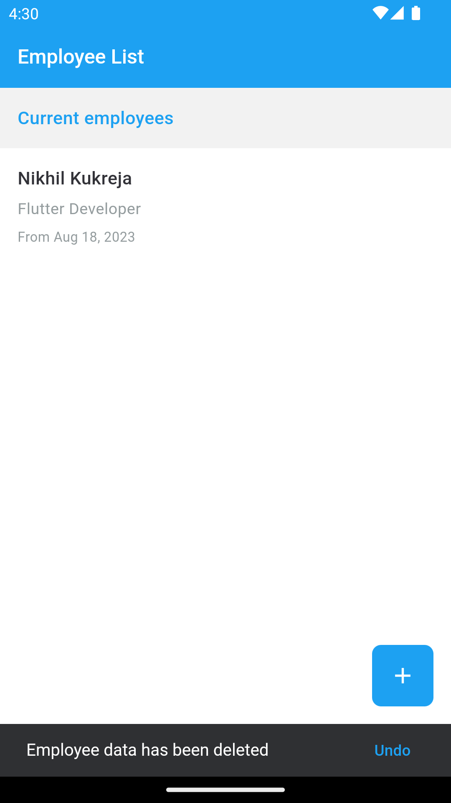
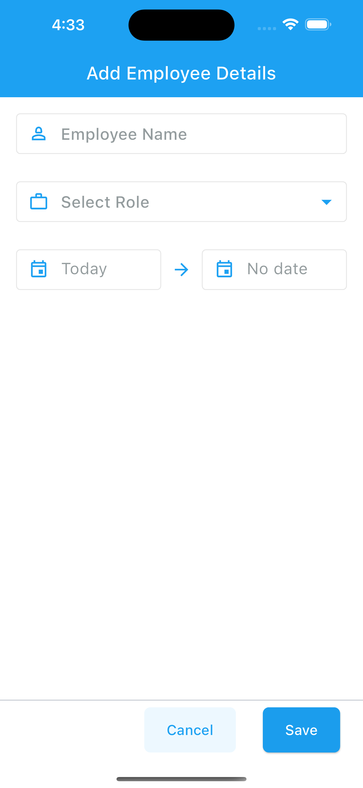

# Employee Assignment App

It is an Assignment project where user can add/edit and delete employees records. The records will be saved in local database using sqflite database and this project uses bloc state management solution and for navigation GoRouter is used. In order to run this project make sure you have latest Flutter SDK is installed on your machine this project uses
Flutter version - 3.13.0 and Dart SDK - 3.1.0

- To read about what's new in flutter 3.13.0 (https://medium.com/flutter/whats-new-in-flutter-3-13-479d9b11df4d)

